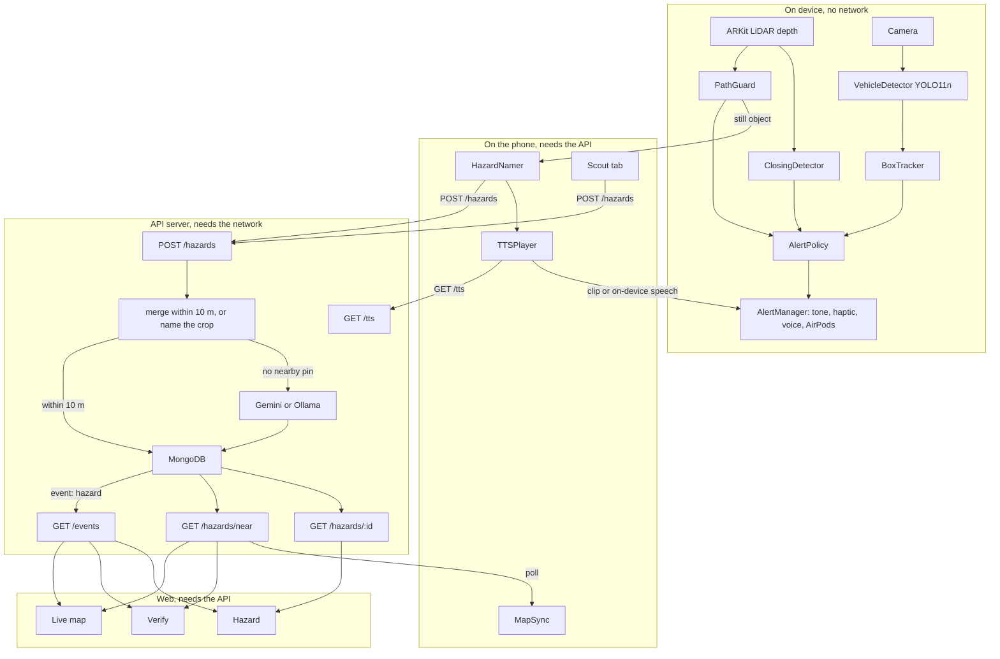
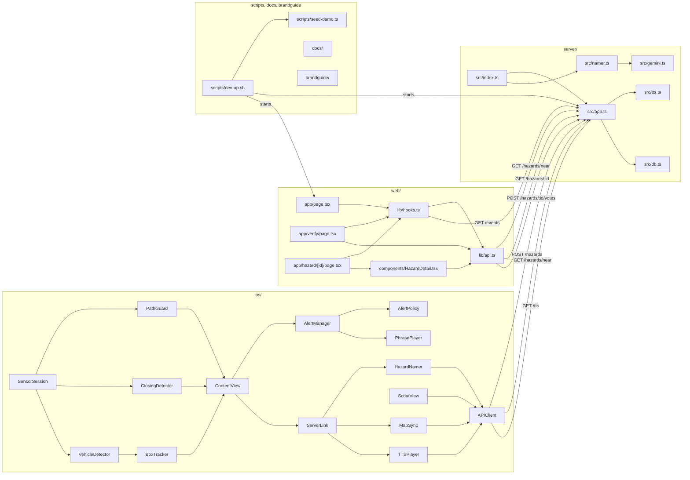

# StepSafe

StepSafe warns blind and low-vision pedestrians about hazards ahead. A head-mounted iPhone uses LiDAR to detect ground obstacles, head-height hazards, and drop-offs. ClosingDetector warns about anything closing fast, including a pushed cart. YOLO11n warns about cars and bikes beyond LiDAR range. Sighted people report and verify hazards in the Scout tab. The web map shows those reports.

StepSafe does not replace a guide dog or your own judgment. It does not give walking directions.

Built at ShellHacks 2026 at FIU Graham Center in Miami.

## Architecture

Alerts play on the phone with no network. The phone uses the network to report a still hazard, to poll nearby pins, and to fetch a spoken name.

### Product flow

ARKit LiDAR depth feeds PathGuard and ClosingDetector. The camera feeds VehicleDetector, which runs YOLO11n, then BoxTracker. Those detections meet in AlertPolicy, then AlertManager. AlertManager plays a spatial tone, a haptic, and a voice clip. AirPods can ask what is ahead or mute. A still PathGuard hazard leaves the phone through HazardNamer. A Scout report uses the same `POST /hazards`. Closing alerts stay on the phone.



The phone detects an obstacle on the device. On-device alerts do not need a network.

The phone crops the obstacle and sends `POST /hazards` with the crop, latitude, longitude, height band, and `deviceId`. That post is a PathGuard hazard or a Scout report. `ServerLink.handle` does not pin a closing alert.

The server merges the report into a nearby pin, or names the crop. A `GEMINI_API_KEY` selects Google Gemini. With no key, Ollama names the crop when `qwen3.8:27b-mlx` is available. Otherwise the server stores the hazard as type `obstacle` with `needsNaming`.

The phone requests a spoken hazard name from `GET /tts`. With no `ELEVENLABS_API_KEY`, that route returns 503 and the phone uses on-device speech.

The web live map and the verify queue receive the pin on `GET /events` (Server-Sent Events, `event: hazard`) and load `GET /hazards/near`. The hazard page follows `GET /events` for one id and loads `GET /hazards/:id`. It does not call `GET /hazards/near`. Other walkers receive the pin on the next `GET /hazards/near`.

### Codebase

`ios/` is the StepSafe app: Swift, SwiftUI, ARKit, and Core Haptics. `server/` is the Node API. `server/src/index.ts` starts the process, picks the namer, and passes it into `src/app.ts`. `web/` is the Next.js map. The map component is `web/components/Map.tsx`, which loads `LeafletMap.tsx`. The live map, verify, and hazard pages all use it. `scripts/dev-up.sh` starts the local stack and runs `scripts/seed-demo.ts`. `docs/` holds `DEMO.md` and `DEVPOST.md`. `brandguide/` holds logos, colors, and voice. See [brandguide/README.md](brandguide/README.md). `docs/` and `brandguide/` are not on the walk.

ContentView sends each SensorSession output to AlertManager and to ServerLink. AlertManager asks AlertPolicy before it plays. ServerLink is not on the alert path.



- [`server/README.md`](server/README.md) covers the API, env vars, the naming provider, and how to run and test.
- [`web/README.md`](web/README.md) covers pages, map encoding, accessibility, and how to run and build.
- [`ios/README.md`](ios/README.md) covers app modules, the Release build note, tests, the server URL field, and credits.

## Quick start

Use Node 20.19 or newer. The `mongodb` package requires it.

For naming without a Gemini key, run Ollama and pull the model named in `server/.env.example`.

```sh
ollama pull qwen3.8:27b-mlx
```

To use Gemini instead, set `GEMINI_API_KEY` in `server/.env`.

```sh
cd server && npm install && cd ../web && npm install && cd ..
scripts/dev-up.sh
scripts/dev-up.sh stop
```

`scripts/dev-up.sh` starts MongoDB, seeds demo hazards, and starts the API and the web map. `scripts/dev-up.sh stop` stops the processes that script started.

The phone talks to the live API at `https://api.stepsafe.miami` by default. To test against a local `dev-up.sh` stack, enter the printed server URL in the Server URL field in the Walker tab debug panel. The phone and the Mac then need the same network. [`docs/DEMO.md`](docs/DEMO.md) has the pre-demo checklist and the live demo script. [`server/README.md`](server/README.md) lists `MONGODB_URI`, `GEMINI_API_KEY`, and `ELEVENLABS_API_KEY`.

## License

StepSafe is licensed under the [GNU AGPL-3.0](LICENSE). The iOS app bundles the Ultralytics YOLO11n model, which is also AGPL-3.0, so the repo uses that license.

## Credits

- Models, services, libraries, the Inter font, and build tools are listed in [CREDITS.md](CREDITS.md). iOS detail is in [ios/CREDITS.md](ios/CREDITS.md). Texts that have to ship with the app are in [LICENSES/](LICENSES/).
- Map data © [OpenStreetMap](https://www.openstreetmap.org/copyright) contributors, [ODbL 1.0](https://opendatacommons.org/licenses/odbl/). `web/public/osm-graham.json` stays under the ODbL. That file is separate from the AGPL code.

## AI tools used

Ara Babigian and Dev Goswami can explain how this code works. The build used Claude Code (Anthropic), Claude Opus (Anthropic) and Codex (OpenAI) for review, and Cursor cloud agents. Logos were made with GPT Image 2 (OpenAI). The short account is in [CREDITS.md](CREDITS.md).
